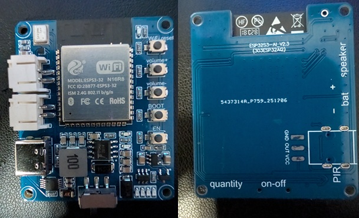

# 303ESP32S3-AI v2.3 ESPHome Configuration
## The Undocumented Xiaozhi AI Voice Board — Reverse Engineered

This repository contains a fully working ESPHome configuration for the **303ESP32S3-AI v2.3** board,
sold on eBay and AliExpress as a "Xiaozhi AI Voice Chat" module. This board has no official
English documentation, no schematic, and no ESPHome support — so we made our own.



---

## Board Identification

If you have this board, you'll see these markings on the PCB:

- `esp32s3-ai_v2.3`
- `303esp32ai2`
- `5437314r_p759_251206`
- FCC ID: `2bb77-esps3-32`

Other Identification:
- Board size: 39x45.5mm
- Retina shattering Green and Blue LEDs

Original firmware SKU: `bread-compact-wifi` (Xiaozhi AI v2.0.3, ESP-IDF v5.5)

The board ships running Chinese-language Xiaozhi AI firmware. If your board speaks Chinese when
powered on, you have the right board.

---

## Hardware Specifications

| Component | Details |
|---|---|
| MCU | ESP32-S3-WROOM-1 N16R8 |
| Flash | 16MB |
| PSRAM | 8MB Octal (OPI) |
| Microphone | INMP441 I2S MEMS |
| Amplifier | MAX98357A I2S Class-D |
| USB | CH340X (one-key flash, no manual reset needed) |
| Battery | TP5400 management chip, PH2.0 connector |
| Speaker | PH2.0 connector (included in kit) |
| Buttons | 5x (Vol Up, Vol Down, WiFi, BOOT, EN) |
| LEDs | 4x Blue (TP5400 battery indicator), 2x Red, 1x Green |
| PIR | Header exposed (GND, OUT, VCC) — HC-SR501 compatible |

---

## Confirmed GPIO Pinout

This pinout was determined through a combination of:
- Boot log analysis of the factory Xiaozhi firmware
- Binary firmware extraction and hex analysis
- ADC scanning across all available GPIO pins
- Digital input scanning across all available GPIO pins
- Physical PCB trace inspection

| Function | GPIO | Notes |
|---|---|---|
| INMP441 WS (mic clock) | GPIO4 | I2S |
| INMP441 SCK (mic bit clock) | GPIO5 | I2S |
| INMP441 SD (mic data) | GPIO6 | I2S |
| MAX98357A DIN (speaker data) | GPIO7 | I2S |
| MAX98357A BCLK (speaker bit clock) | GPIO15 | I2S |
| MAX98357A LRC (speaker word select) | GPIO16 | I2S |
| PIR sensor OUT | GPIO8 | HC-SR501 compatible, INPUT |
| Volume Down button | GPIO39 | INPUT_PULLUP, inverted |
| Volume Up button | GPIO40 | INPUT_PULLUP, inverted |
| WiFi button | GPIO1 | INPUT_PULLUP, inverted, repurposable |
| BOOT | Hardware | Flash mode, not GPIO controllable |
| EN | Hardware | Reset pin, not GPIO controllable |
| 2x Red LEDs | Unknown | Not found after exhaustive GPIO scan |
| 1x Green LED | Unknown | Not found after exhaustive GPIO scan |
| 4x Blue LEDs | N/A | TP5400 hardware controlled, not ESP32 |

---

## Hardware Notes

### Buttons
- **Vol Up / Vol Down** — exposed as binary sensors in HA, wire to automations for volume
  control or any other purpose
- **WiFi button** — in original Xiaozhi firmware this triggered WiFi provisioning. In ESPHome
  it is fully repurposable via HA automations — use it for anything you like: mute, scene
  change, presence toggle, etc.
- **BOOT** — hardware flash button, holds GPIO0 low to enter flash mode. Not controllable
  in firmware.
- **EN** — hardware reset button. Not controllable in firmware.

### PIR Sensor
The PIR header (GND, OUT, VCC) is compatible with the HC-SR501 and similar 3.3V PIR sensors.
The OUT pin is confirmed on **GPIO8**. The HC-SR501 has two adjustment potentiometers:
- **Sensitivity** — adjust before soldering if possible
- **Time delay** — minimum ~3 seconds, set to preference

Allow 30-60 seconds after boot for the HC-SR501 to warm up before it begins detecting reliably.

### Battery
The TP5400 supports external **3.7V LiPo single cell batteries** via the PH2.0 connector.
Common compatible batteries include 18650 cells with PH2.0 leads or flat LiPo packs
in the 500mAh-2000mAh range.

**Important:** Pay close attention to polarity before connecting — positive and negative
are marked on the PCB. Reversing polarity will damage the board.

The TP5400 provides:
- Charging via USB-C while battery is connected
- Automatic switchover between USB and battery power
- Battery level indication via the 4x blue LEDs (25% per LED)
- Overcharge and overdischarge protection

The board will function normally on USB power alone without a battery connected.

### LEDs
The **4 blue LEDs** are driven directly by the TP5400 battery management IC and indicate charge
level. They cannot be controlled via software. The only way to silence them is physical
(tape, nail polish, or desoldering).

The **2 red LEDs and 1 green LED** were not found after exhaustive scanning of all available
ESP32-S3 GPIO pins as both inputs and outputs. They are believed to be hardwired to power rails
rather than controlled by the ESP32. The green LED appears to be a simple power indicator
(always on when USB connected). If you identify these pins, please submit a PR!

### What's NOT on this board variant
- **No OLED display** — The Xiaozhi firmware attempts to initialize an SSD1306 display and fails.
  A sibling SKU exists with the display populated. Your board is the "compact" variant without it.
- **No camera** — Camera support exists in the firmware but no header is present on this variant.

### PSRAM
This board uses **octal PSRAM** (N16R8). The `psram: mode: octal` setting is mandatory.
Using the wrong mode will cause boot failures or instability.

### Flash Mode
`CONFIG_ESPTOOLPY_FLASHMODE_QIO: "y"` is required in sdkconfig_options. Without it the board
may experience subtle instability or boot issues after extended uptime.

---

## Prerequisites

Before flashing this configuration you will need a working Home Assistant installation
with the following components configured:

### Required
- **Home Assistant OS** — tested on Core 2026.5.2, OS 17.3, Frontend 20260429.4
- **ESPHome Device Builder** — tested on 2026.5.0b1 (beta). Standard release may work
  but has not been verified with this configuration.
- **Faster-Whisper** — local speech to text engine. Install via HA Add-on Store.
  Recommended model: `large-v3-turbo` for best accuracy on a CPU-based server.
- **openWakeWord** — only required if using server-side wake word instead of local
  `micro_wake_word`. Install via HA Add-on Store.
- **A configured Voice Assistant pipeline** — Settings → Voice Assistants → Add Assistant.
  Set STT to Faster-Whisper and TTS to your preferred engine.

### Text to Speech Options
Any HA-compatible TTS engine will work. Popular choices:
- **Piper** — fully local, fast, decent quality. Install via HA Add-on Store.
- **Home Assistant Cloud (Nabu Casa)** — subscription based, highest quality voices.
- **Edge TTS** — free, Microsoft Azure voices, requires internet connection.

### Hardware
- 303ESP32S3-AI v2.3 board
- USB-C cable (data capable, not charge-only)
- 5V USB power supply (quality matters — cheap supplies can cause instability)
- Optional: HC-SR501 PIR sensor for motion detection
- Optional: 3.7V LiPo battery for untethered operation

---

## ESPHome Setup

### First Flash
Since this board has a CH340X USB chip, flashing is straightforward:
1. Connect via USB-C
2. May need to hold BOOT depending on flash method
3. Flash using ESPHome dashboard or CLI

### Wake Word Configuration

This configuration uses **local on-device wake word processing** via `micro_wake_word`.
This means wake word detection happens entirely on the ESP32-S3 itself, without any
round trip to Home Assistant. Benefits include:

- Lower latency response
- No duplicate wake word conflicts when using multiple satellites
- Works even if HA is briefly unavailable

The default wake word is **"Hey Jarvis"**. To change it, modify the model line:

```yaml
micro_wake_word:
  models:
    - model: hey_jarvis    # default
```

Other available models include:

| Wake Word | Model String |
|---|---|
| Hey Jarvis | `hey_jarvis` |
| Okay Nabu | `okay_nabu` |
| Hey Mycroft | `hey_mycroft` |
| Alexa | `alexa` |

Simply replace `hey_jarvis` with your preferred model string and reflash.

### Cloud/Server-Side Wake Word (Alternative)

If you prefer to use openWakeWord running on your Home Assistant server instead of
local processing, replace the `micro_wake_word` block and update `voice_assistant` as follows:

```yaml
voice_assistant:
  id: va
  microphone: va_mic
  speaker: va_speaker
  noise_suppression_level: 0
  auto_gain: 31dBFS
  volume_multiplier: 4.0
  use_wake_word: true
  on_wake_word_detected:
    - voice_assistant.start:
  on_end:
    - delay: 1s
    - voice_assistant.start_continuous:
  on_error:
    - lambda: |-
        if (code.size()) {
          ESP_LOGD("va", "VA error: %s", code.c_str());
        } else {
          ESP_LOGD("va", "VA error: <empty>");
        }
    - delay: 10s
    - voice_assistant.start_continuous:
```

And remove the `micro_wake_word:` block entirely.

**Note:** When using server-side wake word with multiple satellites, you may encounter
`duplicate_wake_up_detected` errors if all devices hear the same wake word simultaneously.
Using different wake words per room or switching to local processing resolves this.

### Multiple Rooms
To deploy to multiple boards, only change these values per device:
- `name:`
- `friendly_name:`
- `api encryption key:` — generate a new one for each device

Everything else including GPIO assignments is identical across all boards of this model.

### Secrets Required
Add these to your ESPHome `secrets.yaml`:
```yaml
wifi_ssid: "Your WiFi SSID"
wifi_password: "Your WiFi Password"
api_key: "Generate with ESPHome dashboard"
ap_password: "Your fallback AP password"
```

### Volume Button Automations
The Vol Up and Vol Down buttons are exposed as binary sensors in HA.
Example automation:
```yaml
automation:
  - alias: "Voice Satellite Volume Up"
    trigger:
      - platform: state
        entity_id: binary_sensor.master_bedroom_volume_up
        to: "on"
    action:
      - service: number.set_value
        target:
          entity_id: number.master_bedroom_volume
        data:
          value: "{{ [states('number.master_bedroom_volume') | float + 10, 100] | min }}"
```

### WiFi Button Automations
The WiFi button is fully repurposable. Example — use it to toggle a scene:
```yaml
automation:
  - alias: "WiFi Button Toggle Scene"
    trigger:
      - platform: state
        entity_id: binary_sensor.master_bedroom_wifi_button
        to: "on"
    action:
      - service: scene.turn_on
        target:
          entity_id: scene.bedroom_night
```

### PIR Motion Automations
The PIR sensor is exposed as a motion binary sensor in HA. Example — turn on lights on motion:
```yaml
automation:
  - alias: "PIR Motion Lights"
    trigger:
      - platform: state
        entity_id: binary_sensor.master_bedroom_motion
        to: "on"
    action:
      - service: light.turn_on
        target:
          entity_id: light.bedroom_lights
```

---

## Troubleshooting

### Board won't flash
- Make sure your USB-C cable supports data (not charge-only)
- The CH340X handles flashing automatically
- If it still fails, try holding BOOT before flashing, then release after flash begins

### Board boots but won't connect to HA
- Check your `api encryption key` matches what HA expects
- Verify WiFi credentials in `secrets.yaml`
- Watch the ESPHome logs — connection issues are clearly reported

### `stt-no-text-recognized` error
- Speak your command immediately after the wake word without pausing
- Try increasing `volume_multiplier` to `6.0` or higher
- Check Faster-Whisper is running and healthy in HA
- Switch STT engine to Faster-Whisper if not already using it
- In Faster-Whisper settings, try setting beam size to 1 for faster response

### Wake word not triggering
- Give the board 5-10 seconds after boot before speaking
- Check openWakeWord threshold in Settings → Devices & Services → Wyoming → openWakeWord
- Lower threshold from 0.5 to 0.3 for more sensitivity
- Increase `volume_multiplier` if mic pickup is weak

### Board goes unresponsive after extended use
- This is a known issue in ESPHome/HA voice pipeline — the `on_error` restart logic
  in this config mitigates it
- Check HA logs for aioesphomeapi errors
- Ensure HA is updated to 2026.5.2 or later which includes aioesphomeapi fixes
- Verify power supply quality — `Power On` reset reason indicates power instability

### Compiler runs out of memory / crashes during build
- The micro_wake_word model adds significant compile overhead
- Close other applications on your HA host during compilation
- If using a low-RAM system, try compiling without `micro_wake_word` first then add it
- Sometimes a second compile attempt succeeds after the first fails

### PSRAM boot hang
- Ensure `psram: mode: octal` is set — this is mandatory for N16R8
- Ensure `CONFIG_ESPTOOLPY_FLASHMODE_QIO: "y"` is in sdkconfig_options
- Do NOT add `CONFIG_SPIRAM_MODE_OCT` to sdkconfig_options when using the `psram:` block
  — having both causes a boot hang

### Duplicate wake word detected errors
- Occurs when multiple satellites all hear the same wake word simultaneously
- Solution: use local `micro_wake_word` (default in this config) instead of server-side
  wake word — each device processes independently eliminating the conflict

---

## How We Figured This Out

This board came with zero English documentation. Here's how the GPIO pinout was reverse engineered:

### 1. Board Identification
The board was identified by powering it on and capturing the serial boot log, which contained:
```I (232) Board: UUID=ee2f52e2-c6cf-4633-b1e0-a9fb258aea01 SKU=bread-compact-wifi```
This SKU matched the Xiaozhi AI open source firmware repository.

### 2. Factory Firmware Analysis
A full flash backup was extracted using [esptool-js](https://espressif.github.io/esptool-js/)
and analyzed using PowerShell string extraction:
```powershell
$bytes = [System.IO.File]::ReadAllBytes("C:\backup.bin")
[System.IO.File]::WriteAllText("C:\strings_out.txt", [System.Text.Encoding]::ASCII.GetString($bytes))
Select-String -Path "C:\strings_out.txt" -Pattern "gpio|i2s|audio|button|led" | Out-File "C:\results.txt"
```
This confirmed the use of `NoAudioCodecSimplex` driver, `AdcButton` for buttons,
`SingleLed` for LEDs, and the source file path `./main/boards/bread-compact-wifi/compact_wifi_board.cc`.

### 3. Audio Pin Confirmation
The INMP441 and MAX98357A GPIO assignments were cross-referenced against the Xiaozhi firmware
source and confirmed working through ESPHome compilation and testing.

### 4. Button Discovery
Buttons were found using ADC scanning — adding temporary ADC sensors to every available GPIO
and monitoring voltage changes while pressing each button:
- GPIO1 dropped to 0V when WiFi button pressed (confirmed)
- GPIO39 changed state when Vol Down pressed (confirmed)
- GPIO40 changed state when Vol Up pressed (confirmed)

The BOOT and EN buttons are hardware pins not accessible via GPIO.

### 5. PIR Pin Discovery
The PIR header OUT pin was found by adding digital binary sensor inputs across all remaining
unidentified GPIO pins and connecting an HC-SR501 PIR sensor. GPIO8 was confirmed when it
changed state in response to motion detection.

### 6. LED Investigation
An exhaustive scan of all available ESP32-S3 GPIO pins (GPIO1-21, GPIO38-42, GPIO48) was
performed as both digital inputs and outputs. No pins were found that corresponded to the
2x red or 1x green LEDs. These LEDs are believed to be hardwired to power rails and not
under ESP32 control.

---

## Known Issues / TODO

- [ ] 2x Red LED GPIO pins not identified — believed hardwired to power rail
- [ ] 1x Green LED GPIO pin not identified — believed hardwired as power indicator
- [ ] Volume buttons wired as binary sensors — HA automations needed for actual volume control
- [ ] Blue battery LEDs cannot be disabled in software (TP5400 hardware controlled)

---

## Contributing

If you've identified the LED GPIO pins or any other undiscovered features of this board,
please submit a PR! This was a community reverse engineering effort and further contributions
are welcome.

---

## AI Assistance

This project was reverse engineered with significant assistance from AI language models.
The process involved multiple AI systems each contributing different strengths:

- **Claude (Anthropic)** — Primary assistant throughout the project. Led the binary firmware
  analysis, GPIO scanning strategy, ESPHome configuration development, and iterative
  debugging across several days. Stayed in the trenches for the long haul.

- **DeepSeek** — Contributed a detailed technical summary of findings mid-project that
  helped consolidate knowledge and identify the `bread-compact-wifi` SKU significance.

- **Copilot (Microsoft)** — Provided a second opinion on configuration stability.
  Correctly identified the `on_error` lambda logging fix and suggested the WiFi RSSI
  sensor.
  
The combination of human curiosity, persistence, a soldering iron, and AI assistance
turned a completely undocumented eBay mystery board into a fully documented,
community-ready ESPHome configuration.

If you're attempting something similar with another undocumented board, the approach
that worked here was:
1. Extract and analyze the factory firmware binary
2. Capture the boot log for SKU/board identification
3. Cross reference against open source firmware repositories
4. Systematic GPIO scanning — ADC for buttons, digital for PIR, output for LEDs
5. Iterate, iterate, iterate

Good luck. You'll need it. But probably less than we did.

---

## License

MIT — use freely, attribution appreciated but not required.
